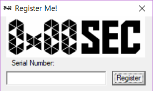
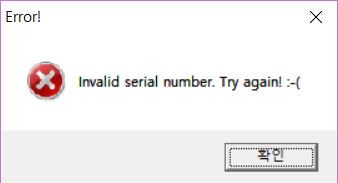
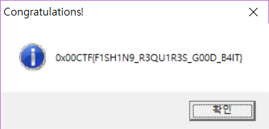

`#anti-debugging`, `#obfuscate`, `#jmp`, `#unicode`
# challenge-001 (Gone Fishing)
50 pt
## Description
```
Platform: Windows; XP or above
Focus: Serial Fishing
Difficulty: Easy
Points: 50
```

--------------------
## Writeup
안티디버깅 문제였다.  
  
키값을 실패하면  
  
`"Try again!"`  
  
그러나 문자열 `"Try again!"` 이 검색안됬는데  
`MessageBox` 가 쓰인다고 보고  
그 언저리를 확인해보았다.  
```
.idata:00470158 ; int __stdcall MessageBoxW(HWND hWnd, LPCWSTR lpText, LPCWSTR lpCaption, UINT uType)
.idata:00470158                 extrn MessageBoxW:dword ; CODE XREF: .text:0040101Ep
.idata:00470158                                         ; DATA XREF: .text:0040101Er

.idata:00470170 ; int __stdcall MessageBoxA(HWND hWnd, LPCSTR lpText, LPCSTR lpCaption, UINT uType)
.idata:00470170                 extrn MessageBoxA:dword ; CODE XREF: .text:00401270p
.idata:00470170                                         ; sub_403B80+117p
.idata:00470170                                         ; DATA XREF: ...
```
위의 `MessageBoxW` 는  
`"Invalid serial number. Try again! :-("` 출력할 때 사용되고  
아래의 `MessageBoxA` 는  
`"Congratulations!"` 출력할 때 사용된다.  
  
이제 해당 부분부터 거슬러 올라가보려 한다.  
```
.text:00401010                 push    10h
.text:00401012                 push    offset aError   ; "Error!"
.text:00401017                 push    offset aInvalidSerialN ; "Invalid serial number. Try again! :-("
.text:0040101C                 push    0
.text:0040101E                 call    ds:MessageBoxW
.text:00401024                 retn						; Breakpoint
```
`.text:00401010` 부분을 보니 XREF 가 없어보인다.  
즉, 다른 함수가 call 을 하지 않는것 처럼 보였다.  
이는 디버거가 해석을 못하도록 안티디버깅 기법을 적용시켜서 code 가 깨져있을 것으로 예상했다.  
  
동적으로 어느부분에서 위 함수를 call 했는지 확인해보았다.
```
.text:001713E7 byte_1713E7 db 0FFh                     ; CODE XREF: .text:001713DDj
.text:001713E8 dd 71E850FFh, 83000001h, 0B60F04C4h, 74C985C8h, 0F48D8D0Dh, 0E8FFFFFDh
.text:001713E8 dd 0FFFFFD5Ch, 5E805EBh
.text:00171408 db 0FCh, 0FFh, 0FFh
.text:0017140B ; ---------------------------------------------------------------------------
.text:0017140B mov     eax, 1			; <- rip
.text:00171410 jmp     short loc_171436
```
위 코드를 잘 변환시켜주면
```
.text:001713D7 xor     eax, eax
.text:001713D9 jnz     short near ptr unk_1713E2	   ; naver taken
.text:001713DB jz      short loc_1713E3
.text:001713DB ; ---------------------------------------------------------------------------
.text:001713DD db 0E9h ; 
.text:001713DE db    5
.text:001713DF db    0
.text:001713E0 db    0
.text:001713E1 db    0
.text:001713E2 unk_1713E2 db  6Ah ; j                  ; CODE XREF: .text:001713D9j
.text:001713E3 ; ---------------------------------------------------------------------------
.text:001713E3
.text:001713E3 loc_1713E3:                             ; CODE XREF: .text:001713DBj
.text:001713E3 lea     eax, [ebp-20Ch]
.text:001713E9 push    eax
.text:001713EA call    check_171560
.text:001713EF add     esp, 4
.text:001713F2 movzx   ecx, al
.text:001713F5 test    ecx, ecx
.text:001713F7 jz      short fail_171406
.text:001713F9 lea     ecx, [ebp-20Ch]
.text:001713FF call    congratz_171160
.text:00171404 jmp     short loc_17140B
.text:00171406 ; ---------------------------------------------------------------------------
.text:00171406
.text:00171406 fail_171406:                            ; CODE XREF: .text:001713F7j
.text:00171406 call    tryAgain_171010
.text:0017140B
.text:0017140B loc_17140B:                             ; CODE XREF: .text:00171404j
.text:0017140B mov     eax, 1						   ; <- rip
.text:00171410 jmp     short loc_171436
```
`.text:001713D9` 의 `jnz` 는 절대로 이행되지 않는다.  
바로 위에 `xor` 로 인해 `ZF` 가 `set` 되기 때문이다.  
따라서 `.text:001713DB` 의 `jz` 가 무조건 수행된다.  
  
다음으로 check_171560 를 분석해보자.
```
.text:0017157A jnz     short near ptr unk_171583       ; naver taken
.text:0017157C jz      short loc_171584
.text:0017157C ; ---------------------------------------------------------------------------
.text:0017157E db 0E9h ; 
.text:0017157F db    5
.text:00171580 db    0
.text:00171581 db    0
.text:00171582 db    0
.text:00171583 unk_171583 db  6Ah ; j                  ; CODE XREF: check_171560+1Aj
.text:00171584 ; ---------------------------------------------------------------------------
.text:00171584
.text:00171584 loc_171584:                             ; CODE XREF: check_171560+1Cj
.text:00171584 mov     ecx, [ebp+arg_0]
.text:00171587
.text:00171587 loc_171587:
.text:00171587 call    sub_171490
.text:0017158C cmp     eax, 0Dh                        ; length >= 0xD
.text:0017158F jnb     short good_171595
.text:00171591 xor     al, al
.text:00171593 jmp     short loc_1715F3
```
이번에도 역시 같은 방식의 안티디버깅이 있었고  
시리얼의 길이가 0xD 보다 크거나 같다는 것을 알게 되었다.  
  
```
.text:001715C7 mov     ecx, [ebp+lpMem]
.text:001715CA call    serial_171030		; strcpy_serial( lpMem );
```
위 함수가 시리얼을 생성했고  

```
.text:001715CF mov     edx, [ebp+lpMem]		; 시리얼이 저장되어 있음
.text:001715D2 mov     ecx, [ebp+arg_0]		; 우리가 입력한 시리얼
.text:001715D5 call    chkSerial_171450
```
진짜 시리얼과 입력한 시리얼이 일치한지 확인한 다음  
flag 를 만들어 MassageBox 를 띄운다.  
  
 
