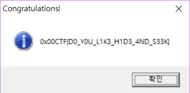

# challenge-003
175

## Description
> 003  

```
$ md5sum *
e8add85431616ec49a14b054b1538b78  challenge-003.exe
0c1a90a4365fb52391475f3e33fa58f6  challenge-003.zip
```

## Writeup
이 문제는 CreateProcess 로 새 프로세스를 만들어 그 안에 코드를 삽입하였고 분석해보니 flag 가 숨겨져 있었습니다.  
  
```
void __noreturn start()
{
  _set_app_type(2);
  sub_401180();
}
```
GUI app으로 시작하는거를 보니 WinMain 이 있을거 같습니다.
```
int __stdcall WinMain_401C24(int a1, int a2, int a3, int a4)
{
  void **v4; // ebx@1

  v4 = sub_41E040(0x10u);
  sub_401CA4(v4);
  sub_401D80(v4);
  sub_401EE0(v4);
  sub_401F2C(v4);
  here_401F96(v4);
  if ( v4 )
  {
    sub_401D28(v4);
    sub_41DFE0(v4);
  }
  return 0;
}
```
위에서 호출되는 함수들 중에  
`here_401F96()` 은 LoadLibrary, GetProcAddress 을 여러번 호출하고 있었습니다.  
호출 목록: kernel32.CreateProcess, kernel32.GetThreadContext, ntdll.ZwUnmapViewOfSection, kernel32.VirtualAllocEx, kernel32.WriteProcessMemory, kernel32.SetThreadContext, kernel32.ResumeThread, kernel32.WaitForSingleObject, kernel32.CloseHandle  
새로 만들어진 프로세스를 분석해보면  
```
int __userpurge sub_401200@<eax>(int ebx0@<ebx>, int *esi0@<esi>, int a1, int a2, int a3, int a4)
{
  char v7; // [sp+0h] [bp-34h]@2
  char v8; // [sp+22h] [bp-12h]@2

  if ( !sub_401090(ebx0, esi0) )
  {
    sub_456760(&v7, 0, 48);
    sub_401000();
    v8 = 0;
    user32_MessageBoxA(0, &v7, "Congratulations!", 64);
  }
  return 0;
}
```
sub\_401090 은 flag 를 숨기려고 일부러 1 만을 반환하도록 만든거 같습니다.  

## Flag
  
`0x00CTF{D0_Y0U_L1K3_H1D3_4ND_S33K}`
