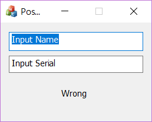
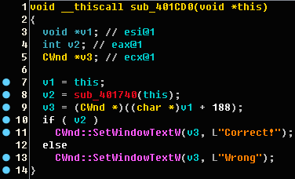
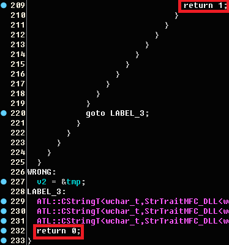

`#keygen`, `#solver`, `#z3`  
# Position
Point: 160   Solved: 732  
  
  
## 요약
본 Writeup 은 z3 를 이용하여 풀었습니다.  
`serial`과 `passwd`의 맨 마지막 문자열 `p`는 `ReadMe.txt`에 주어져있었고  
프로그램을 실행시켰을 때 보이는 `Wrong` 문자열을 cross reference 로 따라가서  
`Correct!`가 나오기위한 조건을 리버싱을 통해 수집하고  
z3를 통해 답을 도출했습니다.  
1. `serial`은 `76876-77776`. `passwd[3]`은 `p`  
2. `passwd` 길이 4.  
3. `passwd`는 `a~z`로 이루어져 있음.  
4. `passwd`는 문자가 중복 사용되지 않음.  
5. `serial`은 길이 11. `serial[5]`는 `-`  
6. `serial`과 `passwd`를 비교 검증  
  
## 분석
`ReadMe.txt`:  
> ReversingKr KeygenMe  
>   
>   
> Find the Name when the Serial is 76876-77776  
> This problem has several answers.  
>   
> Password is \*\*\*p  
```
     3	serial = '76876-77776'
     ...
     9	s.add(passwd[3] == ord('p'))
```
주어진 `ReadMe.txt`를 보면 `serial`과 `passwd`의 마지막 글자는 `p`로 정해져있습니다.  
  
  
  
프로그램을 실행시켜보면 `Wrong`이라는 문자열이 눈에 띕니다.  
  
  
  
유니코드로 `Correct!`가 하드코딩되어있다는 것을 알게되었습니다.  
  
  
  
`sub_401740`의 return 값에 따라 `Correct!`일지 `Wrong`일지 결정됩니다.  
  
  
  
`Correct!`가 나오려면 `return 1;`을 목표로 다라가야합니다.  
  
  
  
```
     4	len = 4
     5	passwd = [BitVec('passwd%i'%i, 8)for i in range(len)]
```
`ReadMe.txt`를 봐도 알겠지만 `passwd`의 길이는 4로 정해져있습니다.  
  
  
  
```
    11	for i in range(len):
    12		s.add(passwd[i] >= ord('a'))
    13		s.add(passwd[i] <= ord('z'))
```
`passwd`는 `a~z`로 이루어져 있습니다.  
  
  
  
```
    15	for i in range(len):
    16		for j in range(i+1,len):
    17			s.add(passwd[i] != passwd[j])
```
`passwd`는 중복된 문자가 존재하지 않습니다.  
  
  
  
`serial`의 길이는 11이고 5번째 인덱스의 문자는 `-`입니다.  
  
  
  
```
    19	passwd_0_0 = (passwd[0] & 1) + 5
    20	passwd_0_1 = ((passwd[0] >> 4) & 1) + 5
    21	passwd_0_2 = ((passwd[0] >> 1) & 1) + 5
    22	passwd_0_3 = ((passwd[0] >> 2) & 1) + 5
    23	passwd_0_4 = ((passwd[0] >> 3) & 1) + 5
    24	
    25	passwd_1_0 = (passwd[1] & 1) + 1
    26	passwd_1_1 = ((passwd[1] >> 4) & 1) + 1
    27	passwd_1_2 = ((passwd[1] >> 1) & 1) + 1
    28	passwd_1_3 = ((passwd[1] >> 2) & 1) + 1
    29	passwd_1_4 = ((passwd[1] >> 3) & 1) + 1
```
본격적인 serial Number 와 Name 의 검증이 시작됩니다.  
`passwd`의 한 bit에 5 또는 1을 더하고 있습니다.  
  
  
  
```
    31	s.add(passwd_0_0 + passwd_1_3 == serial[0])
```
두 값의 덧셈이 `serial`의 각각의 인덱스와 같아야합니다.  
  
  
  
```
    32	s.add(passwd_0_4 + passwd_1_4 == serial[1])
```
  
  
  
```
    33	s.add(passwd_0_2 + passwd_1_1 == serial[2])
```
  
  
  
```
    34	s.add(passwd_0_3 + passwd_1_0 == serial[3])
```
이런식으로 `serial[10]`까지 하면 됩니다.  
  
  
  
